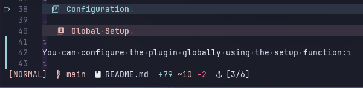

# lualine-harpoon.nvim



A tiny [Lualine](https://github.com/nvim-lualine/lualine.nvim) component for
[ThePrimeagen/harpoon2](https://github.com/ThePrimeagen/harpoon).
Displays your current Harpoon mark as `[x/y]` in your statusline.

## Requirements

- Neovim 0.8+
- [nvim-lualine/lualine.nvim](https://github.com/nvim-lualine/lualine.nvim)
- [ThePrimeagen/harpoon](https://github.com/ThePrimeagen/harpoon) (harpoon2 branch)

> [!IMPORTANT]  
> Make sure to install [harpoon2](https://github.com/ThePrimeagen/harpoon/tree/harpoon2), not harpoon on `master` branch.

## Installation

### Using lazy.nvim

```lua
{
  "nvim-lualine/lualine.nvim",
  dependencies = {
    "kristoferssolo/lualine-harpoon.nvim",
    dependencies = {
      { "ThePrimeagen/harpoon", branch = "harpoon2" }
    },
  },
}
```

## Basic Usage

Once installed, simply add `"harpoon"` to your `lualine.setup` sections.  
Lualine will auto-load `lua/lualine/components/harpoon.lua` for you:

```lua
{
  sections = {
    lualine_c = {
      "harpoon",
    },
  },
}
```

When you have Harpoon marks, you'll see an indicator like `[2/5]` in your statusline.

## Configuration

### Global Setup

You can configure the plugin globally using the setup function:

```lua
{
 -- Configure symbols used in the display
 symbol = {
  open = "[",
  close = "]",
  separator = "/",
  unknown = "?",
 },
 -- Icon displayed before the harpoon status
 icon = "󰀱",
 -- Show component even when there are no harpoon marks
 show_when_empty = false,
 -- Custom format function (overrides default formatting)
 format = function(current, total)
  return string.format("Harpoon: %s/%d", current or "?", total)
 end,
 -- Cache timeout in milliseconds for performance
 cache_timeout = 100,
}
```

### Per-Component Configuration

You can also pass options directly in your Lualine sections:

```lua
{
 sections = {
  lualine_c = {
   {
    "harpoon",
    symbol = {
     open = "(",
     close = ")",
     separator = "|",
     unknown = "?",
    },
    icon = "🎯",
    show_when_empty = true,
   },
  },
 },
}
```

## Configuration Options

| Option | Type | Default | Description |
|--------|------|---------|-------------|
| `symbol.open` | `string` | `"["` | Opening bracket for the display |
| `symbol.close` | `string` | `"]"` | Closing bracket for the display |
| `symbol.separator` | `string` | `"/"` | Separator between current and total |
| `symbol.unknown` | `string` | `"?"` | Symbol when current position is unknown |
| `icon` | `string` | `"󰀱"` | Icon displayed before the status |
| `show_when_empty` | `boolean` | `false` | Show component when no harpoon marks exist |
| `format` | `function?` | `nil` | Custom format function `(current, total) -> string` |
| `cache_timeout` | `number` | `100` | Cache timeout in milliseconds for performance |

## Custom Formatting

You can provide a custom format function to completely control the display:

```lua
{
  sections = {
    lualine_c = {
      {
        "harpoon",
        format = function(current, total)
          if total == 0 then
            return "No marks"
          end
          local mark = current and ("Mark " .. current) or "Not marked"
          return string.format("%s (%d total)", mark, total)
        end,
      },
    },
  },
}
```

## Health Check

Run `:checkhealth lualine-harpoon` to verify your setup and dependencies.

## Performance

The component includes caching to avoid unnecessary recalculation on every statusline update. The cache is automatically invalidated when:

- You switch buffers
- Buffer content changes
- Harpoon marks are modified

You can adjust the cache timeout via the `cache_timeout` option if needed.

## Acknowledgments and alternatives

This plugin was inspired by and serves as an alternative to [letieu/harpoon-lualine](https://github.com/letieu/harpoon-lualine).

## License

This project is licensed under the MIT License - see the [LICENSE](LICENSE) file for details.
